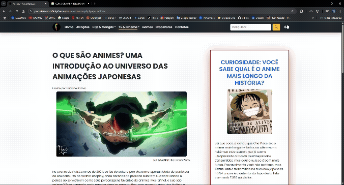

# 🌐 Projeto Integrador 2025 — Portal FATECon HQs

Este é um projeto acadêmico desenvolvido com base na *FATECon HQs*, um evento geek anual realizado em São Roque - SP. A proposta foi criar um portal dinâmico e acessível, utilizando **PHP e MySQL**, para oferecer uma experiência moderna e inclusiva aos visitantes.

> 🔗 Acesse o projeto online: [https://portalfatecon.infinityfree.me/](https://portalfatecon.infinityfree.me/)

---

## 🛠 Tecnologias Utilizadas

* **PHP**
* **MySQL**
* **HTML5**
* **CSS3**
* **JavaScript (DOM, LocalStorage, AJAX)**
* **Bootstrap**
* **Leitor de Tela (Acessibilidade)**

---

## 📌 Funcionalidades

* Portal dinâmico com integração ao banco de dados
* Layout responsivo para todos os dispositivos
* Modo escuro persistente com `localStorage`
* Inserção de conteúdo com AJAX
* Navegação acessível para leitores de tela
* Interface e código otimizados e refatorados

---

## ✨ Minha Contribuição Pessoal

O projeto foi realizado em equipe, com 6 integrantes. Após a entrega oficial, decidi revisitar e melhorar o portal, aplicando minha visão de design e boas práticas de desenvolvimento.

Melhorias realizadas:

* Refatoração de todo o código
* Redesign dos layouts e cores
* Imagens otimizadas com alta qualidade
* Implementação do modo escuro
* Ajustes de acessibilidade e navegação

---

## 📚 Aprendizados

Este projeto foi essencial para consolidar meu conhecimento em:

* Programação em PHP com integração a banco de dados
* JavaScript moderno e interatividade com o usuário
* Design de interfaces responsivas e acessíveis
* Boas práticas de codificação e estruturação de projetos

---

## ▶️ Como Rodar Localmente

1. Clone o repositório:

   ```bash
   git clone https://github.com/FabianoR27/projetoIntegrador2025.git
   ```

2. Importe o banco de dados `portalfatecon.sql` para o MySQL (pelo phpMyAdmin ou terminal) (está localizado na pasta `/src/database/`)

3. Inicie o servidor local com o XAMPP ou outro ambiente de sua escolha

4. Acesse `http://localhost/projetoIntegrador2025/` no navegador

---

## 📸 Captura de Tela do Modo Escuro 😅

> 


---

## 🤝 Contribuições

Críticas construtivas, sugestões e feedbacks são muito bem-vindos. Estou sempre buscando evoluir como desenvolvedor!

---

## 📂 Licença

Este projeto é de uso acadêmico e não possui fins comerciais.

---
